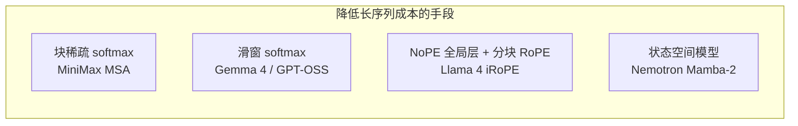

# 第十六周作业：课堂未讲开源模型的结构特点

## 1. 选题说明

本周课件（`model_code/`、`tech_reports/`）已经给出并讲解了：

- DeepSeek-V4（CSA/HCA + mHC）
- Kimi K3（KDA + AttnRes + LatentMoE）
- GLM-5.2（DSA + IndexShare）
- Qwen3.6（Gated DeltaNet 混合层）

上述模型不再重复。本报告检索 **课件与课堂均未出现** 的开源 / 开源权重模型，从注意力、MoE、位置编码、多模态接入方式归纳结构特点。选取 5 个代表不同技术路线的模型：

| 模型 | 为何值得看 | 相对课件模型的差异 |
|------|------------|-------------------|
| MiniMax-M3 | 块级稀疏注意力 MSA | 检索粒度是 **KV 块** 而非 token，主干仍是 GQA 而非 MLA |
| Llama 4 | 开源里极少见的 **10M** 上下文 | 用 **NoPE 层** 而不是线性注意力或 KV 压缩 |
| Gemma 4 | 端侧 / 中小模型的混合注意力 | **K=V 共享**、p-RoPE、部分规格无独立视觉编码器 |
| Nemotron 3 Super | **Mamba-2 + Transformer + LatentMoE** | 主体不是注意力，而是状态空间模型 |
| GPT-OSS | OpenAI 开源权重的 MoE | 滑窗极窄（128）且 **1:1** 交替，带 Attention Sink |

资料截止 2026 年 8 月，来自官方 model card、技术报告与论文（MiniMax arXiv:2606.13392、Gemma 4 arXiv:2607.02770、Nemotron 3 Super arXiv:2604.12374 等）。

---

## 2. MiniMax-M3：块级稀疏 GQA（MSA）

### 2.1 定位

MiniMax-M3（2026-06）是原生多模态 MoE：**约 428B 总参、23B 激活、1M 上下文**。相对上一代 M2，官方给出 1M 上下文下约 **9× prefill / 15× decode**，单 token 注意力算力约降到 1/20。结构上它 **没有** 走 DeepSeek 的 MLA，也 **没有** 走 Kimi/Qwen 的线性注意力，而是在 **标准 GQA** 上加一层可学习的块检索。

### 2.2 MiniMax Sparse Attention（MSA）

MSA 把注意力拆成两支（论文 arXiv:2606.13392）：

1. **Index Branch（索引支）**  
   极轻量：在标准 GQA 上只多两套投影。对 KV 做 **块划分**（典型 `B_k=128`），用 max-pooling 给每个块打分，**每个 GQA 组独立** 选出 Top-k 个块（实验常用 `k=16`）。当前局部块 **强制保留**，避免训练初期检索崩掉。

2. **Main Branch（主支）**  
   只对选中块做精确 softmax 注意力，仍是 GQA（例如实验配置 64 Q-head / 4 KV-head，`d_h=128`）。

与课件中 DSA / CSA 的关键差别：

| | DeepSeek DSA / GLM IndexShare | MiniMax MSA |
|--|-------------------------------|-------------|
| 主干 | MLA | **GQA**（更易接到现有 CUDA 栈） |
| 选择粒度 | token 级 top-k | **block 级** top-k |
| 选择共享 | 常跨 head 或跨层共享 | **按 GQA 组各自选**，组间检索可以不同 |
| 训练 | indexer 与主注意力耦合方式各异 | 用 **KL** 把 indexer 分布对齐到主支在选中块上的注意力；indexer 梯度与主支切断 |

块级选择的动机是硬件：token 级稀疏很难喂满 Tensor Core；块级访问连续，再配合 **KV-outer** 的稀疏核（按 KV 块收集 Q、拼满 MMA），才能把理论稀疏变成墙钟加速。论文还用 **exp-free Top-k**（先选块再 softmax），避免对全序列做 exp。

### 2.3 其余结构

- 论文中的对照实验模型：词表约 200K，`d=3072`，MoE 为 **128 routed + 1 shared、top-4**；量产 M3 放大到 428B/23B。
- **原生多模态**：图文视频从预训练第 0 步混训，而不是后接视觉适配器。
- 推理提供 `thinking = enabled / adaptive / disabled` 三档。

### 2.4 小结

MSA 的立场是 **Occam’s razor**：尽量少改 GQA，只加一个块索引器，并和 GPU kernel 一起设计。它证明「稀疏 softmax」不必绑定 MLA；在已有 GQA 生态里，**按组选块** 往往比「每层选 2048 个 token」更好映射硬件。

---

## 3. Llama 4：iRoPE、极稀 MoE 与早期融合

### 3.1 定位

Llama 4（2025-04）是 Meta 首次把 **MoE + 原生多模态** 放进开源权重。公开两款激活量相同的模型：

| | Scout (17B×16E) | Maverick (17B×128E) |
|--|-----------------|---------------------|
| 总参 | 109B | 400B |
| 激活 | 17B | 17B |
| 上下文 | **10M** | 1M |
| 预训练 | ~40T | ~22T |

未开源的 Behemoth（约 2T / 288B 激活）作教师，对 Scout/Maverick 做共蒸馏。

### 3.2 MoE：交替 dense / MoE，每 token 只再选 1 个专家

Maverick 的 MoE 层是 **128 routed + 1 shared**，每个 token 走 **共享专家 + 恰好 1 个 routed 专家**。这比 DeepSeek（top-6/8）和 Kimi（top-16）稀一个数量级：存储要放下 400B，但前向激活固定 17B，因此和 Scout 推理成本接近、知识容量不同。

层间采用 **dense 与 MoE 交替**，不是每层都 MoE，以降低通信与路由开销。

### 3.3 iRoPE：用「无位置层」撑超长上下文

课件模型用线性注意力或压缩 KV 来做百万上下文。Llama 4 走第三条路——**iRoPE（interleaved RoPE）**：

- 约 **3 层 RoPE + 1 层 NoPE** 循环。
- **RoPE 层** 做分块局部注意力（chunk，常见 8K），负责近距离顺序。
- **NoPE 层** 完全不加位置编码，在因果掩码下看全序列，负责超远距离关联；RoPE 在极长距离上分数会衰减，NoPE 没有这种衰减。
- **推理时温度缩放**（attention temperature tuning）：NoPE 层按序列位置给 Q 乘一个对数型标量，短上下文几乎不变、超长时锐化注意力，无需改权重。
- Scout 的 RoPE 层对 Q/K 做无参 RMSNorm（QK-norm），稳定超长注意力。

Scout 预训练/后训练做到 256K，再靠 iRoPE 泛化到 **1000 万 token**（官方宣称）。这是开源权重里少见的「不换注意力公式、只改位置编码拓扑」的超长方案。

### 3.4 早期融合多模态

视觉不是「语言模型冻住再接投影」，而是 **early fusion**：图像 patch（MetaCLIP 系编码器，与冻住的 Llama 联合训练以对齐）与文本 token 从预训练起进入 **同一 backbone**。位置在融合后的一维序列上由 iRoPE 统一处理，因此图文可以在任意层交叉注意。

### 3.5 小结

Llama 4 的结构关键词是 **「同样 17B 激活、用专家数换容量」** 和 **「用 NoPE 层换超长程」**。它不依赖 indexer，也不依赖 SSM，代价是 NoPE 全序列层在 10M 上仍然贵，工程上靠分块 RoPE 把大部分层限制在局部。

---

## 4. Gemma 4：端侧友好的局部/全局混合注意力

### 4.1 定位

Gemma 4（Google DeepMind，技术报告 arXiv:2607.02770）覆盖手机到单卡服务器：

| 规格 | 参数 | 层数 | 滑窗 | 上下文 | 模态 |
|------|------|------|------|--------|------|
| E2B | 有效 2.3B | 35 | 512 | 128K | 文/图/音频 |
| E4B | 有效 4.5B | 42 | 512 | 128K | 文/图/音频 |
| 12B Unified | 12B | 48 | 1024 | 256K | 文/图/音频，**无独立编码器** |
| 26B-A4B MoE | 25.2B / 3.8B 激活 | 30 | 1024 | 256K | 文/图，128 expert 选 8 + 1 shared |
| 31B Dense | 30.7B | 60 | 1024 | 256K | 文/图 |

课件里的 Qwen3.6-35B-A3B 也是「小激活 MoE + 混合注意力」，但用的是 Gated DeltaNet。Gemma 4 **不用线性注意力**，只用 **滑窗 softmax + 稀疏的全局 softmax**。

### 4.2 混合注意力与必须以全局层收尾

- E2B：**4 局部 + 1 全局**；其余规格多为 **5:1**。
- **最后一层强制全局**（Gemma 3 曾出现末层是局部、输出看不到全序列的问题）。
- 局部层窗口：小模型 512，大模型 1024——比 GPT-OSS 的 128 宽、比 OLMo 3 的 4096 窄，面向端侧 KV。

### 4.3 全局层的省 KV 技巧

全局层最吃 KV cache，Gemma 4 做了几件课件模型没强调的事：

1. **Unified KV / K=V**：全局层 Key 与 Value **共用**，再配合 KV head 共享，官方称全局 KV 占用最多降约 **37.5%**。
2. **p-RoPE（Proportional RoPE）** 只用在全局层；局部层仍用标准 RoPE。两种位置编码分工：局部管相对位置，全局管可按比例拉伸的长程位置。
3. 全局层 head_dim 较大（报道为 512 量级），以便同时做 K=V 与部分 RoPE 切分（与 FlashAttention-2 不完全兼容，是明确的工程取舍）。

### 4.4 12B 的 encoder-free 与 MTP

12B **Unified** 规格取消独立 ViT / 音频塔，把 40ms 音频块和图像 patch **直接投影进 LLM embedding**，减少端侧内存碎片。视觉/音频编码器在其它规格里是冻结的。另提供 **MTP 草稿头** 做推测解码，以及 QAT 量化权重。

### 4.5 小结

Gemma 4 代表 **「不引入 SSM / 线性注意力，也能把 256K 做到端侧」**：靠局部层降复杂度、靠稀少的全局层做长程，再把全局 KV 用 K=V 压掉一块。MoE 只出现在 26B-A4B，主体产品线仍是 dense，和国内旗舰「全系列 MoE」不同。

---

## 5. Nemotron 3 Super：Mamba–Transformer 混合 + LatentMoE

### 5.1 定位

NVIDIA Nemotron 3 Super（约 2026-03，arXiv:2604.12374）是目前开源配方最完整的一类模型之一：**权重 + 数据 + 训练 recipe**。规模 **120.6B 总参 / 12.7B 激活**，预训练 **25T token**，上下文 **1M**，并在 **NVFP4** 下预训练。官方对比：8k 入 / 64k 出设定下，吞吐量可达 GPT-OSS-120B 的约 2.2×、Qwen3.5-122B 的约 7.5×。

这是五份调研里 **唯一以 SSM 为主体** 的模型，和课件里「Transformer + 线性注意力变体」不是同一条谱系。

### 5.2 三种层周期交错

88 层，隐维度 4096，周期交错三类模块：

| 层类型 | 作用 |
|--------|------|
| **Mamba-2** | 大多数序列建模；线性时间、固定状态（state dim 128，128 heads × dim 64，8 groups） |
| **GQA 注意力锚点** | 少量全序列注意力，补 SSM 不擅长的精确联想检索；32 Q-head / **2 KV-head**，`d_h=128` |
| **LatentMoE** | 扩总参、控激活 |

Nemotron 家族惯例：**无位置编码、无 dropout、线性层无 bias**、RMSNorm、embed 与 lm_head 不绑定。1M 上下文不靠 RoPE 外推，而靠 SSM 的平移不变状态 + 稀疏注意力锚点。

### 5.3 LatentMoE（与 Kimi 同名、配置不同）

- 每层 **512 个 expert，top-22**（激活专家数远高于 DeepSeek 的 6–8）。
- 先把 token 从 `d=4096` **投影到 latent 1024**，在潜空间里路由并计算专家，再投影回去。通信和专家参数按 `d/ℓ ≈ 4` 缩小。
- Expert 中间维 2688，另有 shared expert（中间维 5376）。

课件 Kimi K3 的 LatentMoE 是 7168→3584、16/896；Nemotron 是 4096→1024、22/512。同一思想：**专家算力走窄瓶颈，路由仍可很「碎」（top-k 很大）**，有利于 GPU 上细粒度专家并行。

另有 **2 层权值共享的 MTP**，训练多 token 目标，推理当推测解码草稿。

### 5.4 小结

Nemotron 3 Super 把「长上下文」主要交给 **Mamba-2**，注意力降级为 **少数锚点**，再用 LatentMoE 在 12B 激活预算里堆到 120B 总参。若课件讲的是「如何把 softmax 注意力变便宜」，这里则是「**大部分层不再用注意力**」。

---

## 6. GPT-OSS：窄滑窗 1:1 交替与 Attention Sink

### 6.1 定位

OpenAI 于 2025 年开源 **gpt-oss-120b / gpt-oss-20b**（Apache 2.0），面向 agent 与可调推理强度，纯文本。

| | 120b | 20b |
|--|------|-----|
| 层数 | 36 | 24 |
| 总参 / 激活 | 116.8B / 5.1B | 20.9B / 3.6B |
| MoE | 128 expert，top-4 | 32 expert，top-4 |
| 残差维 | 2880 | 2880 |

MoE 权重量化为 **MXFP4**（约 4.25 bit），120b 可进单张 80GB GPU。激活量只有 5.1B，比同总参的 Nemotron Super 更「瘦」。

### 6.2 注意力：GPT-3 风格的 banded / dense 交替

- **隔层交替**：一层全因果注意力，一层 **带宽 128** 的局部带状注意力（比 Gemma 的 512/1024、OLMo 的 4096 窄得多）。
- 每层 **64 个 Q-head（d=64）+ GQA 8 个 KV-head**。
- 全注意力层用 **YaRN** 扩到 **131,072**。
- 每个 head 的 softmax 分母带 **可学习 bias**（attention sink / off-by-one）：允许「谁都不看」，稳定滑窗在长序列上的质量。

没有 indexer、没有 SSM、没有 MLA。结构刻意接近 GPT-2/3 家族，用 **极窄滑窗 + 1:1 全注意力** 控 KV，用 MoE 控激活。

### 6.3 小结

GPT-OSS 说明：即使 2025–2026 年旗舰都在上线性注意力和 DSA，**经典滑窗混合 + 大词表 MoE + 4bit 专家** 仍能做出可单卡部署的推理模型。它的结构课可以当「基线」：理解课件里 CSA/KDA/MSA 多出来的模块，到底比这个 128-token 滑窗买到了什么。

---

## 7. 横向比较：课件外的五条路

课件四模型可以概括成「Transformer MoE +（压缩稀疏注意力 **或** 线性注意力）」。课外这五家把光谱又拉开了：

| 设计问题 | MiniMax-M3 | Llama 4 | Gemma 4 | Nemotron 3 Super | GPT-OSS |
|----------|------------|---------|---------|------------------|---------|
| 大部分层在看什么 | 选中的 KV **块** | 8K 分块（RoPE） | 512/1024 滑窗 | Mamba 状态 | 128 滑窗 |
| 长程从哪来 | indexer 找回的块 | NoPE 全序列层 | 每 5–6 层一次全局 | 稀疏 GQA 锚点 | 隔层全注意力 |
| KV 是否被压缩 | 否，只少算 | 否 | 全局 **K=V** | 注意力层很少 | 否 |
| MoE 稀度 | 中等（量产 ~23B 激活） | **每 token 1 个 routed** | 仅 26B 规格 8/128 | top-22 / 512，但在 1024 潜空间 | top-4 / 128 |
| 位置编码 | RoPE | iRoPE + 温度缩放 | 双 RoPE（局部/p-RoPE） | **无** | RoPE+YaRN |
| 多模态 | 原生混训 | 早期融合 | 编码器或 encoder-free | 文本配方为主 | 无 |

和课件模型对照时，有三点特别值得记：

1. **稀疏注意力不必是 MLA+token top-k。** MiniMax 证明 GQA+**块**检索更贴 GPU；GLM/DeepSeek 的 IndexShare 是「跨层复用 token 下标」，MSA 是「组内独立选块」。
2. **线性注意力 / SSM / NoPE 是三类不同的「非 RoPE 全量 softmax」。** Kimi/Qwen 用 DeltaNet 类循环状态；Nemotron 用 Mamba-2；Llama 4 仍用 softmax，但拿掉位置编码并靠温度缩放撑 10M。
3. **端侧与单卡线仍大量使用滑窗，而不是 indexer。** Gemma 4、GPT-OSS、以及真正全开源的 OLMo 3（3/4 层 SWA=4096 + YaRN 至 65K，本报告不展开）都走这条更简单的路。

---

## 8. 结论

把课堂已讲的 DeepSeek-V4 / Kimi K3 / GLM-5.2 / Qwen3.6 放在一边后，2025–2026 年开源结构并不只有「MLA + DSA」或「Gated DeltaNet」两条路：

- **MiniMax-M3** 把稀疏做成 **GQA 上的块检索**，并用定制核把 1M 上下文做成可部署的墙钟加速。
- **Llama 4** 用 **极稀 MoE（1+shared）** 固定 17B 激活，用 **iRoPE/NoPE** 冲击 10M 上下文，多模态从第一层就融合。
- **Gemma 4** 把混合滑窗做到端侧，全局层用 **K=V 与 p-RoPE** 抠 KV，12B 甚至取消独立视觉编码器。
- **Nemotron 3 Super** 让 **Mamba-2 当主干**，注意力只作锚点，LatentMoE 在 NVFP4 预训练下堆到 120B。
- **GPT-OSS** 回归 GPT-3 式 **128 滑窗 1:1 交替 + sink**，靠 MXFP4 MoE 把 120B 塞进一张 80GB 卡。

若用一句话收束：课件模型展示的是「中文圈旗舰如何改注意力公式」；课外这五家额外展示了 **块稀疏、无位置全局层、K=V 全局层、SSM 主干、极窄滑窗** 五种同样在生产中落地的结构，作业对比时不宜只记住 DSA 与 DeltaNet。

---

## 参考资料

1. Lai et al. *MiniMax Sparse Attention*. arXiv:2606.13392, 2026. https://github.com/MiniMax-AI/MiniMax-M3
2. Meta. *The Llama 4 herd*. 2025. https://ai.meta.com/blog/Llama-4-multimodal-intelligence/ ；[MODEL_CARD](https://github.com/meta-llama/llama-models/blob/main/models/llama4/MODEL_CARD.md)
3. Google DeepMind. *Gemma 4 Technical Report*. arXiv:2607.02770. https://ai.google.dev/gemma/docs/core/model_card_4
4. NVIDIA. *Nemotron 3 Super*. arXiv:2604.12374. https://research.nvidia.com/labs/nemotron/Nemotron-3-Super/
5. OpenAI. *gpt-oss-120b & gpt-oss-20b Model Card*. 2025. https://openai.com/index/gpt-oss-model-card/
6. （对照，未展开）Ai2. *Olmo 3*. https://allenai.org/blog/olmo3
