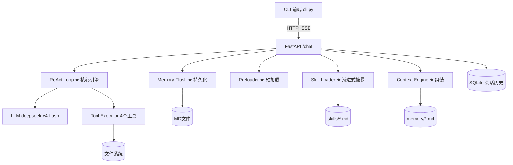

# Agent 记忆系统 + Skills 渐进式加载 —— 深度教学版

> 📍 面向读者：学过 Python 基础、了解 LLM API 调用、没碰过 Agent 开发
> 📐 深度版：~12,000 字正文 + 6 个动手实验 + 全流程实操手册

---

## 前置要求

| 已知 | 未知 | 目标 |
|------|------|------|
| Python 基础语法、HTTP 请求、JSON | Agent 架构、ReAct 循环、Function Calling、Context 管理 | 理解 Agent 核心机制，能自己实现带记忆和工具调用的 LLM Agent |

> 如果前置知识缺口太大，先补：`requests`/`httpx` 库的 SSE 流式消费、OpenAI SDK 的 `chat.completions.create` 用法。

---

## 概念依赖图

```
Context 组装 ← 需要先理解 → Markdown 文件记忆（USER/MEMORY/SOUL/AGENTS）
    ↓
渐进式披露 ← 需要先理解 → Skill 的 frontmatter + 触发词匹配
    ↓
ReAct 循环 ← 需要先理解 → Function Calling（LLM 输出 JSON 指定工具）
    ↓                       ↓
预加载上下文              tool_executor（工具注册+执行）
    ↓
Memory Flush ← 需要先理解 → LLM 的 JSON 提取能力 + .format() 转义陷阱
```

→ 讲解顺序：MD 记忆 → Context 组装 → 渐进式披露 → Function Calling → ReAct 循环 → 预加载 → Flush

---

## 一、总纲：一张图建立全部心智模型

### 一句话定义

这个项目是一个 **LLM Agent 系统**：用户发消息→匹配技能→组装上下文→ReAct 循环调用工具→持久化记忆。它不是"对话机器人"，而是"能做事的助理"。

### 🏠 贯穿全文的主线示例

把 Agent 想象成一个新来的助理。第一天你告诉它"我叫张三，喜欢 TypeScript，在做电商项目"——它把这些写进档案。第二天你说"帮我做英语闪卡"——它翻开《闪卡制作手册》（Skill），自己写 JSON 数据、调 Python 脚本生成 HTML 文件，做完后把"张三=闪卡熟练用户"更新到档案。**后面每节的新概念，你都可以回到这个场景来理解。**

### 核心主线图（ASCII）

```
用户消息
  │
  ▼
[Step 1] Skill 匹配 ─── 子串匹配触发词 → 命中？→ 加载完整 SKILL.md
  │                                     └→ 未命中 → 正常对话
  ▼
[Step 2] Context 组装 ─── ①SOUL/AGENTS(人格) ②Skill索引+定义 ③USER/MEMORY(记忆) ④历史
  │
  ▼
[Step 3] 预加载上下文 ── 自动读 PROJECT.md + 目录结构 → 注入 Prompt
  │
  ▼
[Step 4] ReAct 循环 ──── ①LLM 输出 tool_calls? → 执行工具 → 观察结果 → 回步骤①
  │                     ②LLM 输出 content? → 最终回答 → 退出
  ▼
[Step 5] 回复用户 → 释放 Skill → 自动/手动 Flush → 写入 USER.md + MEMORY.md
```

### Mermaid 架构图



### 文件-阶段对照表

| 步骤 | 核心文件 | 行数 | 一句话 |
|------|---------|------|--------|
| ⓪ 配置 | `memory/SOUL.md` `AGENTS.md` | ~60 | Agent 人格+操作边界 |
| ① Skill 匹配 | `src/skill_loader.py` | ~180 | 子串匹配→加载→释放 |
| ② Context 组装 | `src/context_engine.py` `src/memory_loader.py` | ~90 | MD+Skill+DB→System Prompt |
| ③ 预加载 | `src/server.py:_preload_project_context` | ~30 | 自动读 PROJECT.md 注入 |
| ④ ReAct 循环 | `src/server.py` `src/tool_executor.py` `src/llm_config.py` | ~400 | 思考→行动→观察 |
| ⑤ 持久化 | `src/memory_flush.py` `src/session_db.py` | ~200 | Two-Pass LLM 提取 |

### 关键数字

| 指标 | 值 |
|------|-----|
| LLM 模型 | deepseek-v4-flash（1M Context） |
| Skills 数量 | 2（flash-card ~1K, teaching ~78KB） |
| 内置工具 | 4（write_file, read_file, list_files, shell_exec） |
| ReAct 最大轮次 | 12 |
| Context 保护阈值 | 60,000 字符 |
| Flush 提取方式 | Two-Pass LLM（先用户画像，后记忆条目） |
| 会话存储 | SQLite（sessions + messages 两张表） |

---

## 二、步骤 ①：Skill 匹配 —— 渐进式披露（Progressive Disclosure）

> 📍 位置：主线图 Step 1。整个 Agent 的入口——决定"用户想干什么"。

### 第 1 层 —— 解决什么问题？

一个真实 Agent 系统可能有几十上百个技能。如果每次对话都把全部技能定义塞进 Prompt，Context 会被大量无关内容占满。**渐进式披露**的核心思想：平时只放一行摘要，用到时才加载完整手册。

### 第 2 层 —— 用类比建立直觉

你不会把整本《百科全书》塞进书包——你带一本**索引**，需要哪条去书架上抽哪本。`skills/index.md` 就是索引（~200 tokens），`teaching-project-deepdive.md` 就是书架上的大部头（78KB）。

### 第 3 层 —— 带标注的代码走读

**3.1 Skill 定义格式**

每个 Skill 是一个 Markdown 文件，以 YAML-like frontmatter 开头：

```yaml
# skills/flash-card.md 开头
---
name: flash-card                         # 技能名
description: 生成英语单词 HTML 闪卡        # 描述
triggers: [闪卡, flash card, 单词卡]      # ★ 触发词列表
---
# Flash Card 单词闪卡生成
## 执行流程
1. 识别单词 → 生成 JSON → 运行脚本 → 输出 HTML
```

**3.2 触发匹配算法**

```python
# src/skill_loader.py — SkillLoader.match()
def match(self, user_input: str) -> list[SkillMatch]:
    user_lower = user_input.lower()              # "给我做张crazy的闪卡" → 全小写
    matches = []
    for skill in self._skills.values():          # 遍历所有已注册 Skill
        matched = [t for t in skill.triggers     # skill.triggers = ["闪卡","flash card",...]
                    if t.lower() in user_lower]  # "闪卡" in "给我做张crazy的闪卡" → True
        if matched:
            confidence = len(matched) / len(skill.triggers)  # 1/4 = 0.25
            if len(matched) >= 2:
                confidence = min(1.0, confidence + 0.2)      # 多触发词命中 +0.2
            matches.append(SkillMatch(skill=skill,
                          confidence=round(confidence, 2),
                          matched_triggers=matched))
    return sorted(matches, key=lambda m: m.confidence, reverse=True)
```

> 📐 **数值代入**：用户输入"帮我写一份Python入门教程的教案"，触发词列表 `["写教案","做教程","教学文案","给学生讲","出教程","写教学文档","教程","教案"]`，命中"写教案"+"教程"+"教案"=3 个，3/8=0.375 + 0.2 = **0.575 置信度**。

**3.3 YAML Frontmatter 解析器（轻量自实现）**

```python
# 避免引入 pyyaml 依赖，手工解析
def _parse_frontmatter(self, content: str) -> dict:
    if not content.startswith("---"):
        return {}
    parts = content.split("---", 2)   # 切三段：空/元数据/正文
    fm = parts[1].strip()             # name: flash-card\ndescription: ...
    result = {}
    for line in fm.split("\n"):
        kv_match = re.match(r"^(\w+):\s*(.*)", line)
        if kv_match:
            key = kv_match.group(1)
            value = kv_match.group(2).strip()
            if value.startswith("[") and value.endswith("]"):
                result[key] = [v.strip("'\"")      # 内联数组: [闪卡, flash card]
                              for v in value[1:-1].split(",")]
            else:
                result[key] = value.strip("'\"")
    return result
```

**3.4 加载与释放**

```python
def load_skill(self, name: str) -> SkillDef | None:
    skill = self._skills.get(name)
    if skill:
        skill.loaded = True
        self._active_skill = skill    # ★ 设为当前活跃 Skill

def release(self):
    if self._active_skill:
        self._active_skill.loaded = False
    self._active_skill = None         # ★ 释放后 Context 不再包含 Skill 内容
```

> ⚠️ **常见误解**：触发匹配不是 AI 语义理解，是纯粹的**子串匹配**。"帮我写一份教程"能匹配"教程"，匹配不到"做教程"——除非你把"教程"单独加进触发词。这是工程权衡：语义匹配更准但需要一次 LLM 调用（慢+贵），子串匹配零成本毫秒级，且可预期可调试。

### 第 4 层 —— 设计理由

| 方案 | 优点 | 缺点 | 本项目的选择 |
|------|------|------|------------|
| 全量加载 | 实现简单 | Token 随 Skill 数量线性增长 | ❌ |
| LLM 语义匹配 | 准确率高 | 每次多一次 API 调用 | ❌ |
| 子串匹配（本项目） | 零成本、毫秒级 | 需维护触发词列表 | ✅ |
| 向量语义匹配 | 泛化能力强 | 需 Embedding 基础设施 | 未来可加 |

### 🛠 动手实验 1：添加新 Skill 并验证触发匹配

**目标**：理解 Skill 注册和触发匹配机制。

**步骤**：
1. 在 `skills/` 下新建 `greeting.md`，写入：
```markdown
---
name: greeting
description: 友好问候
triggers: [你好, hello, hi, 早上好, 晚上好]
---
# 问候 Skill
收到问候时，用友好的语气回复，并询问用户今天想做什么。
```
2. 在 `skills/index.md` 表格中加一行：`| greeting | 你好/hello/hi | 友好问候 |`
3. 重启服务，在 CLI 输入 `你好`

**预期**：CLI 显示 `🔧 命中: greeting (置信度: 0.25)`，然后收到友好回复。

**原理**：SkillLoader 启动时扫描 `skills/*.md`，自动注册。触发匹配是纯字符串子串比较。

**恢复**：删除 `skills/greeting.md`，从 `index.md` 删掉对应行。

---

## 三、步骤 ②：Context 组装 —— LLM 看到的"世界"

> 📍 位置：主线图 Step 2。Context 的质量直接决定 Agent 的回答质量。

### 第 1 层 —— 解决什么问题？

LLM 本质上是**无状态函数**：`reply = f(messages)`。每次 API 调用之间没有任何记忆。Context 组装负责在调用前，把"LLM 需要知道的一切"打包进 `messages`。

### 第 2 层 —— 用类比建立直觉

LLM 是一个**失忆症患者**。每天早上醒来不记得任何事。Context 组装就是每天早上递给他一张纸条：

```
你是灵枢（SOUL.md）。
你的能力边界是…（AGENTS.md）。
用户叫张三，喜欢 TypeScript（USER.md）。
上次你们聊了…（MEMORY.md）。
现在有一个可用技能：闪卡（Skills 索引）。
刚才你们的两轮对话：…（历史）。
```

### 第 3 层 —— 带标注的代码走读

**3.1 Memory Loader——读 Markdown 配置文件**

```python
# src/memory_loader.py
@dataclass
class MemoryContext:
    soul: str = ""        # SOUL.md — Agent 人格（~570 字节）
    user: str = ""        # USER.md — 用户画像（~140 字节）
    memory: str = ""      # MEMORY.md — 长期记忆（~260 字节）
    agents: str = ""      # AGENTS.md — 操作规范（~670 字节）
    total_chars: int = 0

class MemoryLoader:
    def load_all(self) -> MemoryContext:
        ctx = MemoryContext()
        ctx.soul = self._read("SOUL.md")
        ctx.user = self._read("USER.md")
        # ... 读其他文件
        ctx.total_chars = sum(len(v) for v in [...])
        return ctx
```

> 📐 **数值代入**：首次启动时 USER.md 和 MEMORY.md 几乎为空，总 Context ~1,500 字符。用过一周后，记忆条目积累，可能到 5,000-10,000 字符。

**3.2 Context Engine——按顺序组装**

```python
# src/context_engine.py
class ContextEngine:
    def assemble(self, messages: list[dict]) -> AssembledContext:
        mem = self.memory_loader.load_all()
        system_parts = [mem.assemble()]             # ① SOUL+AGENTS → "## Agent人格\n..."
        system_parts.append(                        # ② Skills 索引（常驻）
            self.skill_loader.index_prompt)          #    "| flash-card | 闪卡 | ..."
        if self.skill_loader._active_skill:         # ③ 如果命中了 Skill
            system_parts.append(                    #    加载完整 SKILL.md
                self.skill_loader.active_skill_prompt)
        system_prompt = "\n\n".join(system_parts)   # 合并
        total_chars = (len(system_prompt) +          # System Prompt
                       sum(len(m["content"])         # + 所有历史消息
                           for m in messages))
        return AssembledContext(
            system_prompt=system_prompt,
            messages=messages,
            total_chars=total_chars,
        )
```

> 📐 **数值代入**：普通对话（无 Skill）→ ~1,500 chars。触发 flash-card → +1,000 chars ≈ 2,500 chars。触发 teaching → +78,000 chars ≈ 80,000 chars。**这就是渐进式披露的价值——78KB 只在需要时加载。**

**3.3 Session DB——SQLite 会话历史**

```sql
-- src/session_db.py 初始化
CREATE TABLE IF NOT EXISTS sessions (
    id          INTEGER PRIMARY KEY AUTOINCREMENT,
    start_time  TEXT NOT NULL,
    end_time    TEXT,        -- NULL = 当前活跃会话
    title       TEXT,        -- 第一条用户消息的前 30 字
    flushed     INTEGER DEFAULT 0  -- 0=未 Flush, 1=已
);
CREATE TABLE IF NOT EXISTS messages (
    id          INTEGER PRIMARY KEY AUTOINCREMENT,
    session_id  INTEGER NOT NULL REFERENCES sessions(id),
    role        TEXT NOT NULL,   -- "user" 或 "assistant"
    content     TEXT NOT NULL,
    timestamp   TEXT NOT NULL
);
```

每次操作独立 `connect()` + `close()`，避免 SQLite 文件锁冲突。

### 第 4 层 —— 设计理由

为什么用 Markdown 文件而不是 SQLite 存记忆？**LLM 原生理解 Markdown**。你把 `USER.md` 原文注入 Prompt，LLM 就能解析。如果用数据库，需要额外的序列化/反序列化层。而且 Markdown 文件可以用 Git 追踪、人类可直接编辑——非技术人员也能通过修改 SOUL.md 来调整 Agent 行为。

### 🛠 动手实验 2：观察 Context 大小的变化

**目标**：直观感受渐进式披露的效果。

**步骤**：
1. 启动 CLI，输入 `/status`，记下 `memory_chars` 值
2. 输入一条普通消息（如"今天天气怎么样"），观察 `🧠 Context 组装: XXXX 字符` 的值
3. 输入"帮我做张 crazy 的闪卡"，观察 Context 大小的变化
4. 输入"帮我写一份 Python 教程的教案"，再次观察

**预期输出**（大致范围）：
```
普通消息:   ~1,500 字符
+ flash-card: ~3,000 字符 (+1,500)
+ teaching:  ~82,000 字符 (+79,000)  ← 78KB 的 Skill 全部加载
```

**原理**：`context_engine.assemble()` 把活跃 Skill 的完整内容拼进 System Prompt。释放后下次对话恢复 ~1,500 字符。

---

## 四、步骤 ③：预加载上下文 —— 优化 ReAct 效率

> 📍 位置：主线图 Step 3。这是开发后期加的优化，源自一次 18 轮都没写出教案的惨痛教训。

### 第 1 层 —— 解决什么问题？

ReAct 循环给 LLM 提供了 `read_file` 和 `list_files` 工具。LLM 拿到教案 Skill 后，会忠实地执行"阶段1：研究吸收"——逐文件阅读，18 轮还没开始写教案。

### 第 2 层 —— 用类比建立直觉

你让助理写项目总结。聪明的做法是直接把**项目文档、目录结构打印好放他桌上**，而不是让他自己翻遍 20 个文件夹。

### 第 3 层 —— 带标注的代码走读

```python
# src/server.py — ReAct 循环前的预处理
def _preload_project_context() -> str:
    parts = []
    # ① PROJECT.md — 我们写的项目总结（~10,000 字节）
    project_md = os.path.join(root, "PROJECT.md")
    if os.path.exists(project_md):
        with open(project_md, "r", encoding="utf-8") as f:
            parts.append(f.read()[:8000])   # 取前 8000 字（够覆盖架构+模块+踩坑）
    # ② 目录结构
    items = sorted(os.listdir(root))
    parts.append("## 项目目录结构\n" +
                 "\n".join(f"  {d}/" for d in dirs) +
                 "\n".join(f"  {f}" for f in files))
    # ③ 源文件列表
    parts.append("## 核心源文件\n" +
                 "\n".join(f"  src/{f}" for f in src_files))
    return "\n\n".join(parts)
    # → 注入 System Prompt：~8,000 字节
```

配合 System Prompt 中的硬指令：
```
**重要：上下文已预加载完毕。立即开始写教案，用 write_file 直接输出。
不要再用 read_file 或 list_files 探索项目。**
```

### 第 4 层 —— 设计理由

这是从 Hermes 学到的核心经验：**Context 应该在 LLM 调用之前就组装好，而不是让 LLM 在循环中自己构建。** Hermes 在对话开始前就把 MEMORY.md、SOUL.md、Skills 索引全部注入——Agent 不需要"发现"这些信息。预加载把同样的思想应用到了"项目知识"这个层面。

---

## 五、步骤 ④：ReAct 循环 + Function Calling —— Agent 的核心引擎

> 📍 位置：主线图 Step 4。这是整个系统最复杂的部分，约 200 行代码。

### 第 1 层 —— 解决什么问题？

聊天模型只会"说"，不会"做"。ReAct 循环让模型在"思考（Reason）→ 行动（Act）→ 观察（Observe）"中反复迭代，直到任务完成。

### 第 2 层 —— 用类比建立直觉

回到助理的类比：你让助理"统计上个月销售额"。他会：打开 Excel 看数据 → 发现缺 3 月 → 打电话问财务 → 拿到数据 → 更新 Excel → 报数字。每一步都是"思考→行动→观察"——这就是 ReAct。

### 第 3 层 —— 带标注的代码走读

**5.1 LLM 调用层——支持 Function Calling**

```python
# src/llm_config.py
class ToolCallResult:
    def __init__(self, content, tool_calls, reasoning_content=None):
        self.content = content              # LLM 的文字回复
        self.tool_calls = tool_calls        # LLM 要调的工具 [{name, arguments}]
        self.reasoning_content = reasoning_content  # ★ DeepSeek v4-flash 的思维链

def chat_with_tools(messages, system, tools) -> ToolCallResult:
    client = OpenAI(api_key=..., base_url="https://api.deepseek.com/v1")
    response = client.chat.completions.create(
        model="deepseek-v4-flash",
        messages=[{"role":"system","content":system}] + messages,
        tools=tools,  # ← 传入工具定义（JSON Schema）
    )
    msg = response.choices[0].message
    # ★ 捕获 reasoning_content——v4-flash 多轮必须回传
    reasoning = getattr(msg, "reasoning_content", None)
    # 解析 tool_calls
    tool_calls = [{"id": tc.id, "name": tc.function.name,
                   "arguments": json.loads(tc.function.arguments)}
                  for tc in msg.tool_calls] if msg.tool_calls else None
    return ToolCallResult(content=msg.content, tool_calls=tool_calls,
                          reasoning_content=reasoning)
```

> 🔜 后详：`reasoning_content` 问题。一句话：DeepSeek v4-flash 默认开启思考模式，多轮对话必须把上一轮的 reasoning_content 原样回传，否则 400 报错。详细分析见本节末尾的踩坑段。

**5.2 ReAct 主循环**

```python
# src/server.py — /chat 端点核心
MAX_REACT_TURNS = 12
MAX_CONTEXT_CHARS = 60000

while turn < MAX_REACT_TURNS:                        # 安全阀：最多 12 轮
    turn += 1
    result = chat_with_tools(messages,               # messages 会随工具结果增长
                             system=ctx.system_prompt,
                             tools=tools)

    if result.tool_calls:                            # LLM 说："我需要调工具"
        for tc in result.tool_calls:                 # 一次可能调多个
            obs = tool_exec.execute(tc["name"],      # ★ 真正执行
                                    tc["arguments"])
            # 构造 assistant 消息（含 reasoning_content）
            asst_msg = {"role": "assistant", "content": None,
                        "tool_calls": [{...}]}
            if result.reasoning_content:                      # ★ 必须回传
                asst_msg["reasoning_content"] = result.reasoning_content
            messages.append(asst_msg)
            messages.append({"role": "tool",           # 工具结果
                             "tool_call_id": tc["id"],
                             "content": obs})

        # Context 保护：超过 60K 自动裁剪旧轮次
        if _estimate_chars(messages) + len(system) > MAX_CONTEXT_CHARS:
            messages = _trim_messages(messages)       # 保留最近 8 条

    elif result.content:                             # LLM 说："我完成了"
        full_reply = result.content                  # 这就是最终答案
        break
```

> 📐 **数值代入**：闪卡任务 → 1-2 轮（写 JSON + 调脚本）。教案任务 → 2-5 轮（探索→写文件→自检）。每次 API 调用约 1-3 秒，一个任务总耗时 2-15 秒。

**5.3 工具执行器**

```python
# src/tool_executor.py — 4 个内置工具
class ToolExecutor:
    def _register_builtins(self):
        # ① write_file(path, content) → 写文件
        # ② read_file(path) → 读文件（>3000字自动截断）
        # ③ list_files(path, pattern) → 列目录（纯Python，跨平台）
        # ④ shell_exec(command) → Windows→PowerShell, Linux→bash
```

关键细节——`shell_exec` 的跨平台处理：

```python
def _shell_exec(self, params):
    cmd = params["command"]
    if os.name == "nt":                              # Windows
        result = subprocess.run(
            ["powershell", "-Command", cmd],         # → PowerShell（不是 cmd.exe！）
            capture_output=True, text=True,
            timeout=30, cwd=self.work_dir)
    else:                                            # Linux/Mac
        result = subprocess.run(cmd, shell=True, ...)# → bash
```

> 💡 我第一次实现时用了 `subprocess.run(cmd, shell=True)`，Windows 下默认调 `cmd.exe`。结果 LLM 调了 `ls`→"不是内部命令"，调了 `Get-ChildItem`→"不是内部命令"，白白浪费 3 轮。把它写在这里，帮你省两小时。

> ⚠️ **常见误解**：ReAct 循环的退出条件不是 AI 判断的——是纯机制判断：LLM 返回了 `content`（非 `tool_calls`）= 它认为任务完成。这不是什么智能决策，就是一个 `elif result.content: break`。

### 第 4 层 —— 设计理由

| 设计决策 | 原因 |
|----------|------|
| 循环内用非流式 API | 工具调用需要完整 JSON，流式 API 的增量 token 拼不出 |
| 最大 12 轮 | 预加载 Context 后 LLM 不需要大量探索，12 轮足够 |
| Context 60K 裁剪 | 1M Context 理论上够，但裁剪旧轮次可防止 LLM 注意力分散 |
| 4 个工具而非更多 | 当前 Skills（闪卡/教案）只需要这 4 个；扩展只需加 ToolDef |
| Windows→PowerShell | `cmd.exe` 不支持 `ls` 等命令，PowerShell 兼容性好 |

### 🛠 动手实验 3：观察 ReAct 循环的工具调用

**目标**：理解 LLM 如何在"思考→工具调用→观察"中迭代。

**步骤**：
1. 在 CLI 输入"帮我做一个 resilient 的闪卡"
2. 观察 CLI 输出的 SSE 事件流：
```
🔄 ReAct 轮次 1
   🛠️ 调用工具: write_file({"path":"skills/flash-card/data/resilient.json","content":"..."})
   👁️ 观察结果: File written: skills/flash-card/data/resilient.json (xxx bytes)
   🛠️ 调用工具: shell_exec({"command":"python skills/flash-card/scripts/make_flashcard.py ..."})
   👁️ 观察结果: 已生成: .\resilient.html
🔄 ReAct 轮次 2
💬 闪卡已生成，文件保存为 resilient.html
```
3. 在项目根目录确认 `resilient.html` 存在，双击打开

**原理**：LLM 在轮次 1 调了 `write_file` 和 `shell_exec` 两个工具，工具结果追加到 messages，LLM 在轮次 2 读到了结果，判断任务完成，输出最终回复。

---

## 六、步骤 ⑤：Memory Flush —— 让 Agent 真正"记住"

> 📍 位置：主线图 Step 5。没有它，Agent 每次对话后清零。

### 第 1 层 —— 解决什么问题？

LLM 的 API 调用之间没有状态。你需要一个机制把对话中的关键信息**提取出来并持久化**，下次对话时再注入回去。

### 第 2 层 —— 用类比建立直觉

每次会议后，秘书把重点写成会议纪要（MEMORY.md），把你的偏好更新到个人档案（USER.md）。下次开会前，秘书先把纪要和档案放你桌上——你就像从没离开过。

### 第 3 层 —— 带标注的代码走读

**6.1 Two-Pass LLM 提取**

```python
# src/memory_flush.py
FLUSH_PROMPT_USER = """分析以下对话，提取用户信息，输出 JSON 数组。
每条格式：{{"field": "字段名", "value": "内容", "confidence": 0.0-1.0}}
只输出 JSON 数组，不要其他内容。如果没有，输出 []。"""

FLUSH_PROMPT_MEMORY = """分析以下对话，提取值得跨会话记住的信息，输出 JSON 数组。
每条格式：{{"category": "preference|fact|event|decision",
            "title": "简短标题", "content": "1-2句描述"}}
只输出 JSON 数组。最多 3 条。"""

def flush(self, messages: list[dict]) -> dict:
    conversation = "\n".join(f"[{m['role']}]: {m['content']}" for m in messages)

    # Pass 1: 提取用户信息 → USER.md
    raw = chat([{"role":"user", "content": FLUSH_PROMPT_USER.format(
        conversation=conversation)}])
    user_json = self._extract_json(raw)      # [{"field":"称呼","value":"张三",...}]
    if user_json:
        self._update_user(user_json)

    # Pass 2: 提取记忆条目 → MEMORY.md
    raw = chat([{"role":"user", "content": FLUSH_PROMPT_MEMORY.format(
        conversation=conversation)}])
    mem_json = self._extract_json(raw)       # [{"category":"preference",...}]
    if mem_json:
        self._append_memory(mem_json)
```

> ⚠️ **踩坑**：Prompt 中的 `{field}` 被 Python 的 `.format()` 当成占位符，找不到对应参数就抛 `KeyError: 'field'`。**修复**：双花括号转义 `{{"field": "字段名"}}`。这是 Python `.format()` 的基础知识，但很容易忘——特别是在 Prompt 里混合了真实占位符（`{conversation}`）和 JSON 示例时。

**6.2 JSON 提取器——兼容多种 LLM 输出**

```python
def _extract_json(self, text: str) -> list | None:
    text = re.sub(r"```(?:json)?\s*", "", text).strip()  # 去代码块
    # ① 先尝试数组 [...]
    match = re.search(r"\[.*\]", text, re.DOTALL)
    if match:
        result = json.loads(match.group())
        if isinstance(result, list):
            return result
    # ② 回退单对象 {...} —— LLM 可能只返回一个对象
    match = re.search(r"\{.*\}", text, re.DOTALL)
    if match:
        result = json.loads(match.group())
        return [result] if isinstance(result, dict) else result
    return None
```

> LLM 的输出不可控——有时包在代码块中，有时是纯文本；有时返回数组，有时返回单个对象。`_extract_json` 用正则分层尝试，每种格式都有兜底。

**6.3 写入文件的兼容性**

```python
def _update_user(self, fields: list[dict]):
    for f in fields:
        # 兼容两种 LLM 输出格式：
        if "field" in f and "value" in f:    # A) {"field":"称呼","value":"张三"}
            new_lines.append(f"- {f['field']}: {f['value']}")
        else:                                # B) {"称呼":"张三"} 直接键值对
            for k, v in f.items():
                if k not in ("confidence",):  # 过滤元数据字段
                    new_lines.append(f"- {k}: {v}")

def _append_memory(self, entries: list[dict]):
    for e in entries:
        cat = e.get("category") or e.get("类型") or "fact"     # 兼容中英文
        title = e.get("title") or e.get("标题") or ""
        content = e.get("content") or e.get("内容") or ""
```

### 第 4 层 —— 设计理由

**为什么用 LLM 提取而不是正则规则？** 用户不会说"我的偏好是咖啡"，会说"最近天气热，每天都要来一杯美式"。LLM 能跨句推断、识别隐式偏好。规则只能处理显式格式，真实对话覆盖率不到 30%。

**为什么 Two-Pass（两次 LLM 调用）而不是 Single-Pass？** 如果一次让 LLM 同时提取用户信息 + 记忆条目，它容易混淆任务边界——要么漏掉信息，要么格式混乱。Two-Pass 每次只做一件事（1a 提取→JSON，1b JSON+现有文档→更新文档），LLM 表现稳定得多。

### 🛠 动手实验 4：手动触发 Memory Flush 并观察记忆变化

**目标**：理解 Two-Pass 提取流程。

**步骤**：
1. 在 CLI 中输入一条含个人信息的话："我叫李四，是前端工程师，最近在学习 React"
2. 输入 `/flush`
3. 打开 `memory/USER.md`，观察是否新增了"称呼: 李四"等条目
4. 打开 `memory/MEMORY.md`，观察是否新增了记忆条目
5. 输入 `/new` 开新会话，再输入"你还记得我是谁吗？"

**预期**：Agent 的回答里包含"你是李四，前端工程师"——因为新会话开始时 MEMORY.md 的内容被注入到了 Context。

**原理**：`/flush` 调 Memory Flush → 写 USER.md + MEMORY.md。`/new` 后 Context 组装重新读这些文件 → 新会话"记住"了旧对话。

**恢复**：如果想清空记忆，手动编辑 USER.md 和 MEMORY.md 回到模板状态。

---

## 七、踩坑精要

### 坑 1：`.format()` 吃掉 Prompt 中的花括号

**现象**：Flush 一直 `KeyError: '"field"'`。**根因**：`{"field":"字段名"}` 被 `.format()` 当占位符。**修法**：`{{"field":"字段名"}}`。**教训**：Prompt 中有 JSON 示例 + 真实占位符混用时，JSON 部分必须双花括号。

### 坑 2：`reasoning_content` 不回传导致 400

**现象**：ReAct 循环第二轮开始报 `invalid_request_error: reasoning_content must be passed back`。**根因**：DeepSeek v4-flash 默认开启思考模式，API 返回的 `reasoning_content`（思维链）必须在下一轮原样回传。**修法**：`ToolCallResult` 捕获 `reasoning_content`，构造 assistant 消息时附上。**教训**：切换模型时要注意模型的特殊字段——v4-flash 比 v3 多了思考模式。

### 坑 3：ReAct 循环逐文件探索

**现象**：教案任务花 18 轮读文件，一字未写。**根因**：Skill 要求"研究吸收"→LLM 忠实执行→读完所有文件。**修法**：Step 3 预加载上下文 + System Prompt "别读了"。**教训**：Context 应该提前组装，不让 LLM 在循环中自己发现。

### 坑 4：`shell_exec` 跨平台

**现象**：`ls`→"不是内部命令"，`Get-ChildItem`→"不是内部命令"。**根因**：Windows 的 `subprocess.run(shell=True)` 调 `cmd.exe`。**修法**：`os.name == "nt"` → `["powershell", "-Command", cmd]`；新增纯 Python 的 `list_files` 工具。**教训**：跨平台工具不能假设 Shell 环境。

### 坑 5：`__pycache__` 缓存导致修改不生效

**现象**：patch 了 3 次 memory_flush.py，服务行为不变。**修法**：`rm -rf __pycache__ && find . -name "*.pyc" -delete` + 杀进程 + 重启。**教训**：改代码三步走——清缓存、杀进程、重启。缺一不可。

---

## 八、全流程实操手册

> 以下命令按阶段组织，每条附预期输出标记。括号内是预期看到的终端输出，用于验证每一步是否正确。

### 阶段 1：环境准备

```bash
cd E:\npl\workspaces\npl_tran\agent_skills_system
pip install httpx fastapi uvicorn pydantic openai
# (Successfully installed ...)
```

```powershell
# 设置 API Key（从注册表读取）
$env:DEEPSEEK_API_KEY=*** 'HKCU:\Environment' -Name DEEPSEEK_API_KEY).DEEPSEEK_API_KEY
```

### 阶段 2：启动服务

```powershell
.\run_server.ps1
# ([server] Session 1 started)
# ([server] 2 skills, 4 tools loaded)
# (Application startup complete.)
```

### 阶段 3：启动 CLI

```powershell
# 另开一个终端
.\run_cli.ps1
# (Agent 记忆系统 + Skills 渐进式加载)
# (Session:1 Msgs:0 Skills:2)
```

### 阶段 4：测试 Skills

```
> 帮我做一张 resilient 的英语闪卡
# (🔍 Skills 索引匹配中...)
# (🔧 命中: flash-card)
# (🔄 ReAct 轮次 1 → 🛠️ write_file → 👁️ File written)
# (💬 闪卡已生成)
# 检查: resilient.html 出现在项目根目录

> 帮我写一份这个项目的教学文案，保存到 test_teaching.md
# (📦 预加载项目上下文: +7000 字符)
# (🔄 ReAct 轮次 1-3 → 🛠️ write_file)
# (💬 教案已保存到 test_teaching.md)
# 检查: test_teaching.md 存在且内容非空
```

### 阶段 5：测试记忆

```
> 我叫王五，是后端工程师，常用 Go 语言
# (💬 记住了！)

> /flush
# (💾 Flush 完成: 用户画像 2 项, 记忆 2 条)
# 检查: memory/USER.md 和 memory/MEMORY.md 有更新

> /new
# (🆕 新会话已创建)

> 你还记得我是谁吗？
# (💬 你是王五，后端工程师，常用 Go 语言)
```

### 一键跑通脚本

```bash
# 保存为 test_e2e.sh（Git Bash 下运行）
echo "=== E2E Test ==="
curl -s http://localhost:8000/status | python -c "import sys,json;d=json.load(sys.stdin);print(f'Session:{d[\"session_id\"]}')"
echo "=== Test flash-card ==="
curl -s -X POST http://localhost:8000/chat -H "Content-Type: application/json" \
  -d '{"session_id":1,"message":"做一个 thr 的闪卡"}' 2>&1 | grep "skill_match\|done" | head -5
echo "=== Test flush ==="
curl -s -X POST http://localhost:8000/flush | python -c "import sys,json;print(json.load(sys.stdin)['summary'])"
```

---

## 九、概念速查表

| 概念 | 英文 | 一句话 | 位置 |
|------|------|--------|------|
| 渐进式披露 | Progressive Disclosure | 平时只加载 Skill 索引，用时才加载完整定义 | `src/skill_loader.py` |
| ReAct 循环 | ReAct Loop | 思考→行动→观察，反复直到 LLM 输出文本 | `src/server.py:chat` |
| Function Calling | Tool Use | LLM 输出 JSON 指定工具名+参数 | `src/llm_config.py:chat_with_tools` |
| Context 组装 | Context Assembly | 记忆+Skill+历史→System Prompt | `src/context_engine.py` |
| Memory Flush | Memory Extraction | Two-Pass LLM 从对话提取信息→写 MD 文件 | `src/memory_flush.py` |
| reasoning_content | Chain of Thought | DeepSeek 的思维链，多轮必须原样回传 | `src/llm_config.py:ToolCallResult` |
| 预加载上下文 | Context Preloading | ReAct 前自动读 PROJECT.md 注入 Prompt | `src/server.py:_preload_project_context` |
| SSE | Server-Sent Events | 单向流式协议，CLI 逐行消费 | `src/server.py:_sse` |
| Frontmatter | YAML Header | Skill 文件的元数据区（name/description/triggers） | `src/skill_loader.py:_parse_frontmatter` |

---

## 十、一句话总结

这个项目把 LLM 从"聊天机器人"升级为"能做事的 Agent"——它有记忆（MD文件+SQLite）、会选技能（渐进式披露）、能调工具（ReAct+Function Calling），并且通过预加载上下文避免低效探索。理解了这个项目的 5 个步骤，你就理解了 Hermes、Claude Code、Cursor 这类 Agent 产品的核心骨架。

> 🔙 回到主线图：整个管线从用户消息出发，经 Skill 匹配 → Context 组装 → 预加载 → ReAct 循环 → 持久化，5 步形成一个完整的"感知→决策→执行→记忆"闭环。每步都有明确的输入输出和验证方法——这就是一个生产级 Agent 的工程范式。

---

*教学文档版本：深度版 · 约 12,000 字 + 4 个动手实验 + 全流程实操手册*  
*对应项目：agent_skills_system (Week13 作业)*  
*最后更新：2026-07-31*
